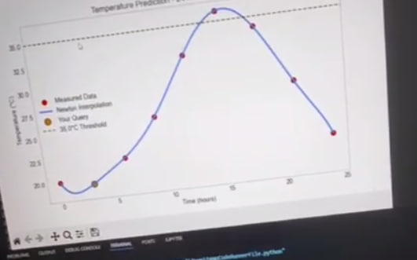

# 🌡️ Temperature Predictor – 24h (Cairo Approx.)

Predicts the temperature at any hour (0–24) using **Newton’s Divided Difference Interpolation** with a **Tkinter GUI** and plots.

---

## ⚡ Features

* Predict temperature for a given hour.
* Shows **LOOCV MAE** for prediction accuracy.
* Detects when the temperature **crosses a threshold** (default: 35°C).
* Interactive **Tkinter GUI**.
* Visualizes predictions with **Matplotlib**.

---

## 🛠️ Tools & Libraries

* Python 3
* **NumPy** – numerical computations
* **Matplotlib** – plotting
* **Tkinter** – GUI interface

---

## 🚀 How to Run

1. Clone or download this repo.
2. Install dependencies:

```bash
pip install numpy matplotlib
```

*(Tkinter comes with Python)*
3. Run the program:

```bash
python temperature_predictor.py
```

4. Enter a time (0–24) in the GUI and click **Predict**.
5. See the predicted temperature, LOOCV MAE, threshold crossing, and plot.

---

## 📊 Input Data

Default temperature series (hard-coded):

| Hour | Temp (°C) |
| ---- | --------- |
| 0    | 20.0      |
| 3    | 19.5      |
| 6    | 22.0      |
| 9    | 26.0      |
| 12   | 32.0      |
| 15   | 36.0      |
| 18   | 34.0      |
| 21   | 28.0      |
| 24   | 22.0      |

## ⚙️ How It Works

* Computes **Newton interpolation polynomial** from the data.
* Evaluates the temperature at the queried time.
* Calculates **LOOCV MAE** for accuracy.
* Detects threshold crossing using **bisection method**.
* Plots measured data, prediction curve, query point, and threshold.
## 📄 License

Open-source, free to use.

## Demo


